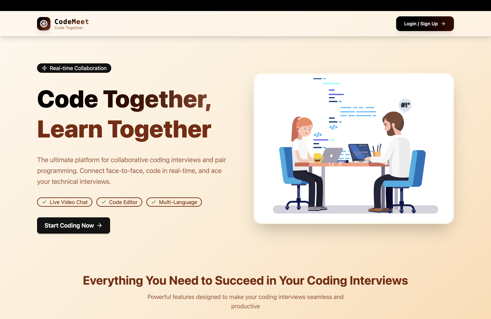
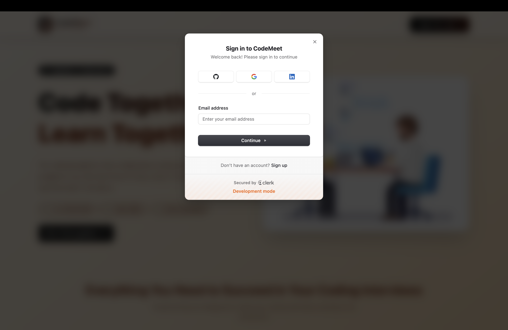
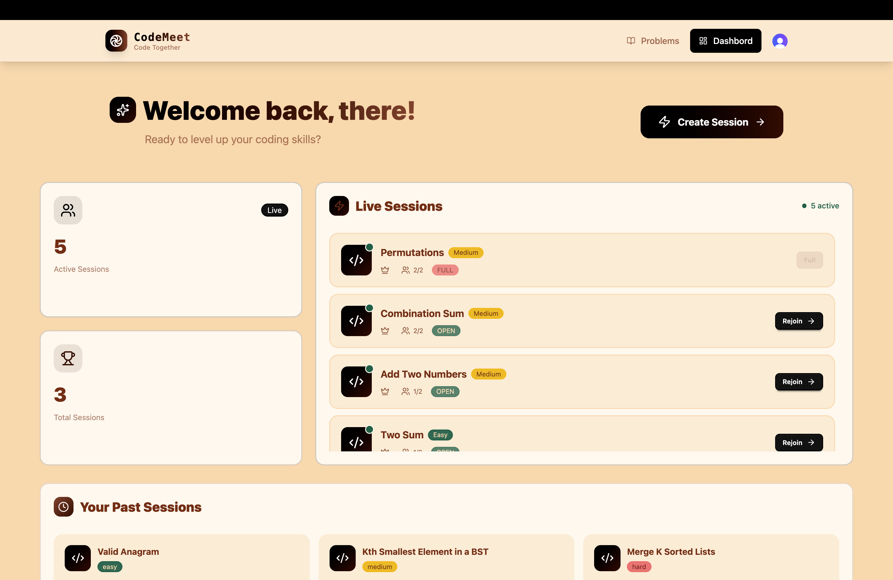
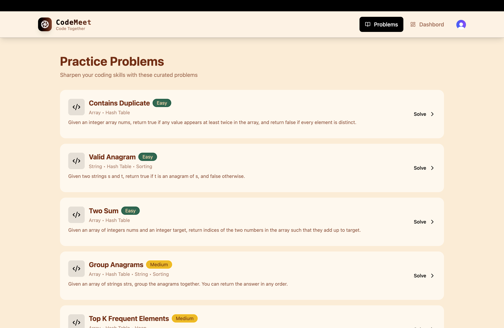
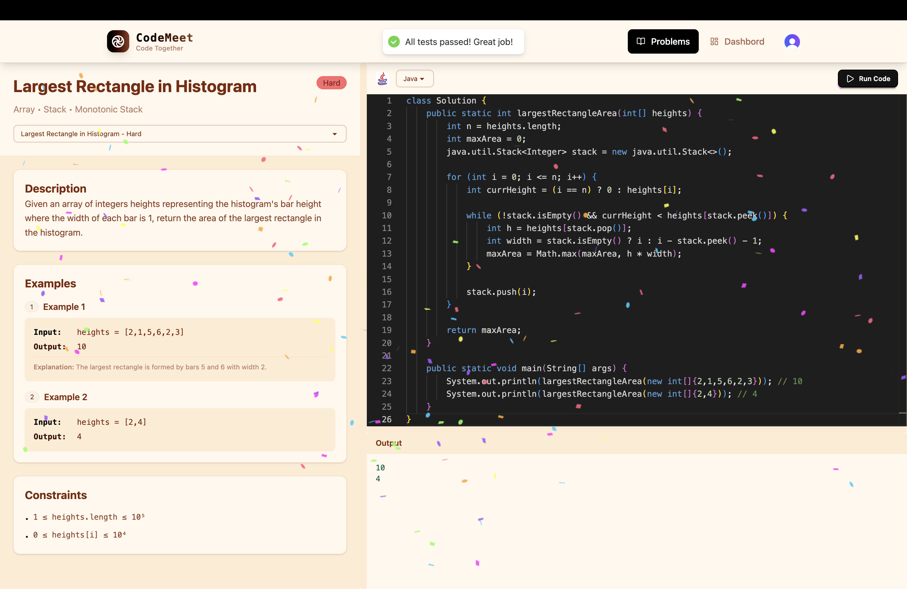
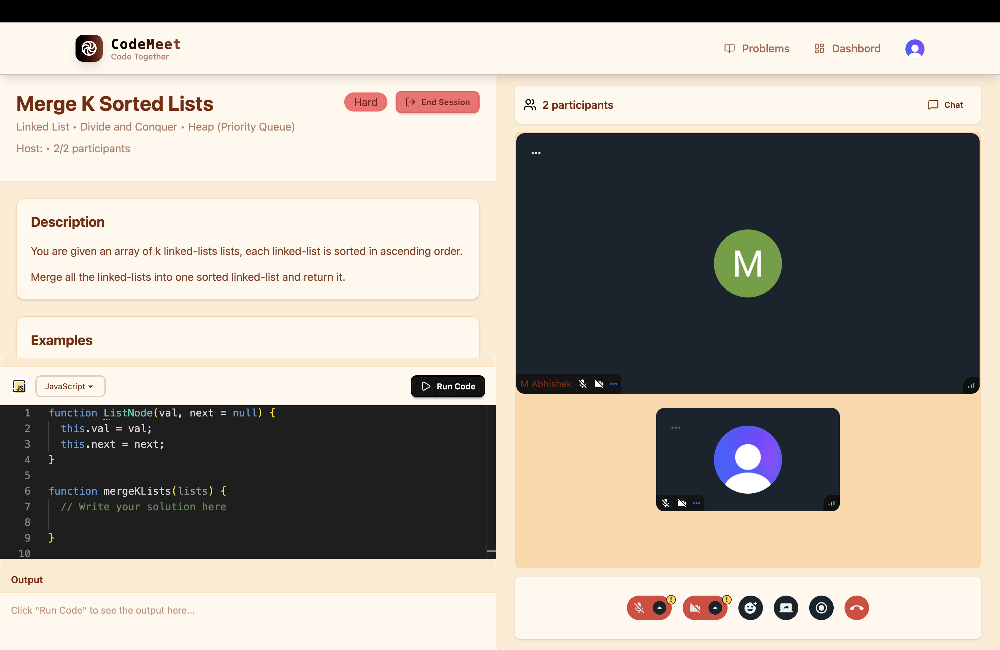
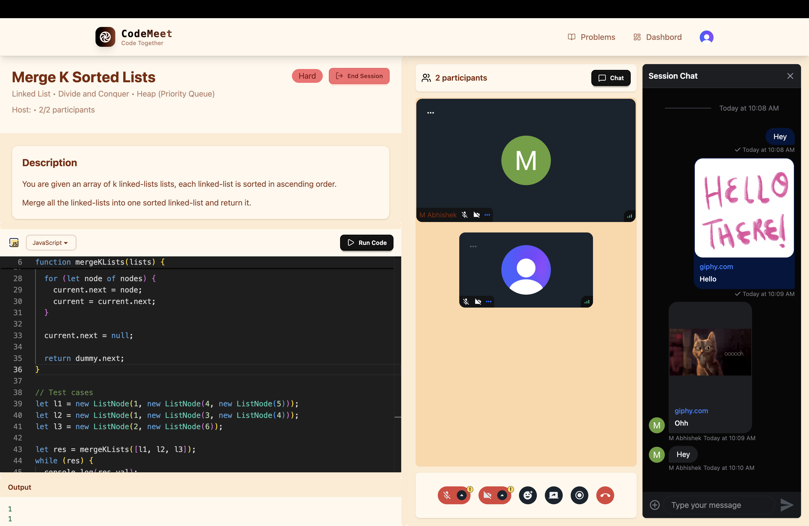

# Real-Time Code Interview Platform (CodeMeet)


A full-stack **real-time code interview platform** for conducting **one-on-one technical interviews** with integrated **video calling, chat, and code execution**.

---

## Live Demo

[View Live Demo](https://realtime-code-interview-platform.onrender.com)

> ⚠️ **Note:**  
> Hosted on Render (free tier). Initial load may take **30–60 seconds** to start.

---

## Tech Stack

### Frontend

- React  
- Tailwind CSS + DaisyUI  
- TanStack Query  
- Clerk (authentication UI + session handling)  
- Stream Video + Chat (client-side SDK)  
- Monaco Editor  

### Backend

- Node.js  
- Express.js  
- MongoDB  
- Mongoose  
- Clerk (authentication, user management, and webhooks)
- Stream SDK (server-side)  
- Inngest  

---

## Services

- **Judge0** – runs user code and returns output/errors  
- **Clerk** – authentication and user management
- **Stream** – video calling and in-session chat  
- **Inngest** – background jobs for syncing users with Stream and MongoDB, and cleanup on deletion  

---

## Features

### Authentication

- Clerk-based authentication  
- User creation and deletion via webhooks  
- Background synchronization handled by Inngest  

---

### Dashboard

- Active sessions  
- Live sessions  
- Recent sessions  
- Total sessions  

---

### Session System

- Create and join interview sessions  
- One-on-one session model  
- Host-controlled session lifecycle  

---

### Problems

- Curated set of 150 coding problems  
- Solve without creating a session  
- Includes descriptions, examples, and constraints  

---

### Real-Time Communication

- One-on-one video calls  
- Audio and camera controls
- Real-time messaging  
- Supports text, images, and GIFs via `/giphy`  
- Screen sharing  
- Reactions  

---

### Coding Environment

- Monaco Editor  
- Supports JavaScript, Python, Java, C++, C, and C#  
- Code execution powered by Judge0  
- Output and error display

---

## Project Structure

```
realtime-code-interview-platform/
│
├── backend/
│   └── src/
│       ├── controllers/
│       ├── lib/
│       ├── middleware/
│       ├── models/
│       ├── routes/
│       └── server.js
│
├── frontend/
│   └── src/
│       ├── api/
│       ├── components/
│       ├── data/
│       ├── hooks/
│       ├── lib/
│       └── pages/
│
├── screenshots/
└── package.json
```

---

## Environment Variables

Create a `.env` file in each project root:

---

### Backend
- `backend/.env` (beside `src`)

```
PORT=your_port
DB_URL=your_mongodb_connection_string
NODE_ENV=development_or_production

CLERK_PUBLISHABLE_KEY=your_clerk_publishable_key
CLERK_SECRET_KEY=your_clerk_secret_key

INNGEST_EVENT_KEY=your_inngest_event_key
INNGEST_SIGNING_KEY=your_inngest_signing_key

STREAM_API_KEY=your_stream_api_key
STREAM_API_SECRET=your_stream_api_secret

CLIENT_URL=your_frontend_url
```

---

### Frontend
- `frontend/.env` (beside `src`)

```
VITE_API_URL=your_backend_url/api
VITE_CLERK_PUBLISHABLE_KEY=your_clerk_publishable_key
VITE_STREAM_API_KEY=your_stream_api_key
```

---

## Setup Instructions

### 1. Clone the repository

```bash
git clone https://github.com/mabhishek-dev/realtime-code-interview-platform.git
cd realtime-code-interview-platform
```

---

### 2. Install dependencies

```bash
cd backend
npm install
```

```bash
cd ../frontend
npm install
```

---

### 3. Run the application

Open two terminals:

**Backend**
```bash
cd backend
npm run dev
```

**Frontend**
```bash
cd frontend
npm run dev
```

---

## Screenshots

### Home Page


### Login / Signup Page


### Dashboard Page


### Problems Page


### Problem Page


### Session Page


### Session Page with Chat


---

## License

This project is licensed under the **MIT License**.
